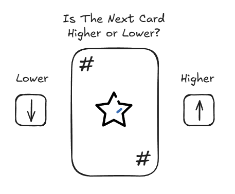

# Higher Or Lower

Will the next card be higher or lower? THAT is the question that beats the game. Seems simple right? Will you be able to guess right and win the game or will you guess wrong and lose? Give it a try and find out. It only takes a few seeconds to complete a game.

## How To Play
Players are presented with a single card between the numbers 1-10 and are then prompted the question that is the name of the game. Higher or Lower? Once the player has picked an answer, a new card will be drawn from the deck.

If the player is correct in their guess, they win the game. If the player is incorrect in their guess, then they lose the game. There is no way for the game to chose the same number again.

## Game Logic
- Players will have a "Start" button to activate the game.
- Players will then be presented with a single card in the middle and two buttons on either side of the card to choose from.
- When either of the two buttons is clicked on, a new card from the deck will be drawn.
- Players who choose "Lower" and receive a card that is lower than the presented card will win.
- Players who choose "Higher" and receive a card that is higher than the presented card will win.
- Players who choose a button and receive a card opposite of their prediction will lose the game.
- A "Play Again" button will appear when the game is over that players can click on to start the whole process over again.

## Wireframing
Once the Player clicks on the "Start" button, this is what the playing field will look like.

## Coding Tech and Languages
- HTML
- CSS
- JavaScript
- PHP
- AJAX
- Bootstrap Vers 5.3

## Motivation
I love video games and decided that I wanted to create one. It had been a while since I've made a web browser game and wanted to start with something simple and small. I told myself that if I could create this little game then I'd be capable of creating more complex games in the future.

## Future Development
Once I reach the MVP of the game, what would be next for the future?

I plan on having a few different game modes for this game. The "Beginner" or "Easy" mode will be the MVP version while a "VS" mode will consist of the player vs the computer. I also think about having a "Multiplayer" mode that branches off of the "VS" mode.

## Play The Game!
The game is currently under development and will be available to be played once MVP has been reached. Thank you for your patience and understanding.